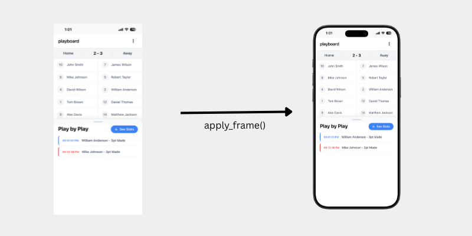

# device-frames-core [View on PyPi](https://pypi.org/project/device-frames-core/)

Python core library for applying device frames to screenshots and retrieving up-to-date media of device frame PNGs (with metadata)



### Usage Example

```bash
pip install device-frames-core
```

```python
from pathlib import Path
from device_frames_core import apply_frame, list_devices

# List devices
all_devices = list_devices()

# Apply a frame
apply_frame(
    screenshot_path=Path("input.png"),
    device="16-pro-max",
    variation="black-titanium",
    output_path=Path("output/framed.png"),
    category="ios",
)
```

Notes
-----

- Device frames and masks are fetched at runtime from https://github.com/jonnyjackson26/device-frames-media. This ensures you always have updated data. If you need a frame that's not listed there, please [add it](https://github.com/jonnyjackson26/device-frames-media?tab=contributing-ov-file)
- The package depends on Pillow.
- Device and variation names use lowercase kebab-case (e.g., "16-pro-max", "black-titanium").


## Create and activate a virtualenv:
```bash
python -m venv .venv
source .venv/bin/activate
```

### Local Testing with tests/test.py:
With virtual enviroment enabled:
```bash
python -m pip install -e .   (pip install in editable mode)
python tests/test.py         (run test file)
```

### Local package testing
```bash
rm -rf dist
python -m pip install --upgrade pip
python -m pip install build twine
python -m build                          #build dist + wheel
python -m twine check dist/*             #Check distribution metadata
```
Install the wheel locally and do a quick import check:
```bash
python -m pip install dist/*.whl
python - <<'PY'
from device_frames_core import list_devices
print(len(list_devices()))
PY
```

### Publish to PyPI 
This project publishes to PyPI using GitHub Actions via the [`.github/workflows/updatePyPi.yml`](../.github/workflows/updatePyPi.yml) workflow, triggered when a GitHub Release is published (`release.published`).

1. Update version in `pyproject.toml`.
2. Commit and push to `main`.
3. Create and push a matching git tag:
   - `git tag v0.1.4`
   - `git push origin v0.1.4`
4. In GitHub:
   - Open **Releases** → **Draft a new release**
   - Choose tag `v0.1.4`
   - Set release title (for example, `v0.1.4`)
   - Add release notes
   - Click **Publish release**
5. GitHub Actions runs `Publish to PyPI` and uploads `dist/*` to PyPI.
